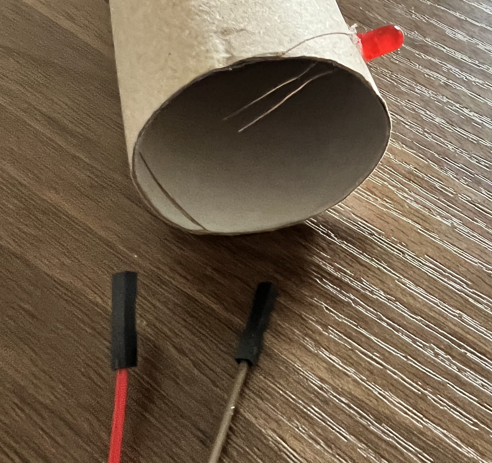
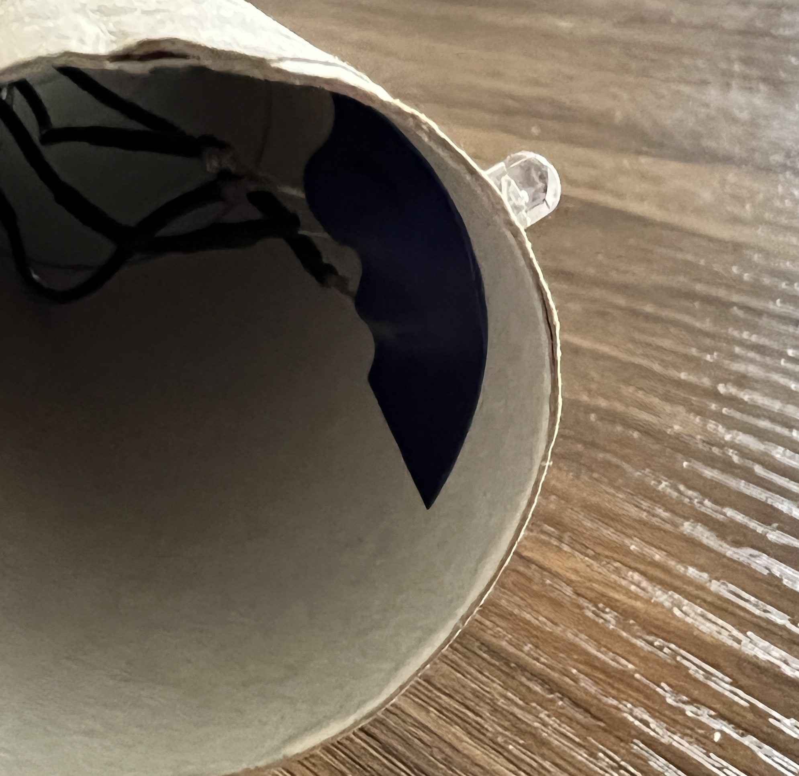

Tu voudras peut-être monter des LED, des boutons, des buzzers et des potentiomètres sur du carton ou du plastique.

Si tes composants ont des fils de raccordement soudés, perce un trou dans le carton ou le plastique, puis pousse le composant par l'arrière.

Si tu utilises des composants avec des fils de raccordement douille-douille, retire les fils de raccordement et pousse les pattes du composant à travers le carton. Pour le plastique, tu devras d'abord faire des trous en utilisant soigneusement un outil avec une pointe acérée.

**Astuce :** Rappelle-toi quelle broche se connecte à quel fil de liaison.

Rebranche ensuite les fils de liaison au dos du carton ou du plastique.

Si nécessaire, tu peux utiliser du ruban adhésif ou du ruban électrique pour maintenir tes composants en place.

