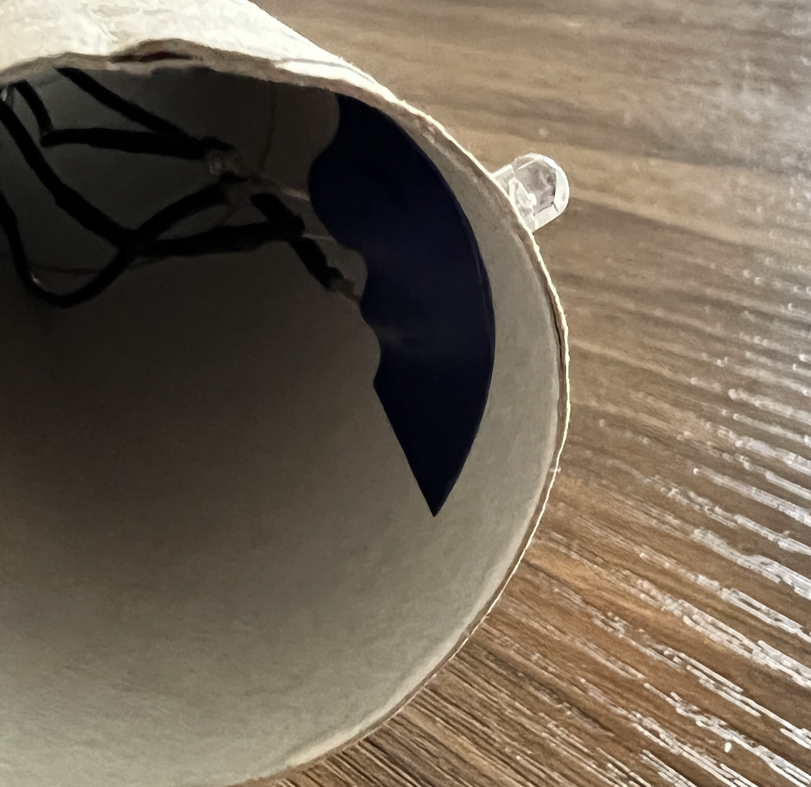

You may want to mount LEDs, buttons, buzzers and potentiometers in card or plastic.

If your components have soldered jumper wires, make a hole in the card or plastic and then push the component through from the back.

If you are using components with socket-socket jumper wires then remove the jumper wires and push the legs of the component through card. For plastic you will need make holes first by carefully using a tool with a sharp point.

**Tip:** Remember which leg connects to which jumper wire.

Then reconnect the jumper wires on the back of the card or plastic.

If necessary you can use sticky tape or electrical tape to keep your components in place.

