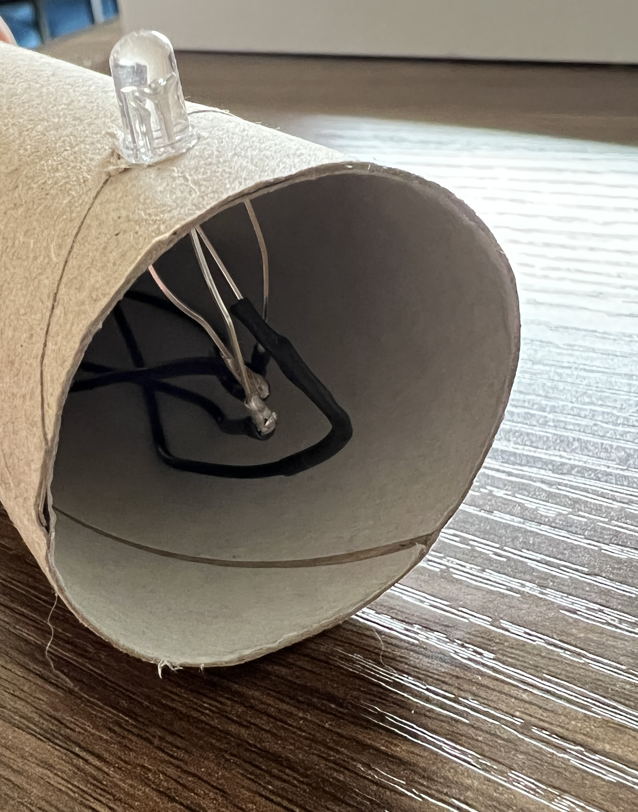

Misschien wil je de LEDs, knoppen, zoemers en potentiometers monteren op karton of plastic.

Als je onderdelen gesoldeerde verbindingsdraden hebben, maak dan een gaatje in het karton of plastic en duw dan het onderdeel er vanaf de achterkant doorheen.

Als je onderdelen met bus-bus verbindingsdraden gebruikt, verwijder dan de verbindingsdraden en duw de benen van het onderdeel door het karton. Voor plastic maak je de gaatjes eerst door voorzichtig een stuk gereedschap met een scherpe punt te gebruiken.

**Tip:** Onthoud welk been aansluit op welke verbindingsdraad.

Sluit vervolgens de verbindingsdraden weer aan op de achterkant van het karton of plastic.

Indien nodig kun je plakband of isolatietape gebruiken om je onderdelen op hun plaats te houden.

